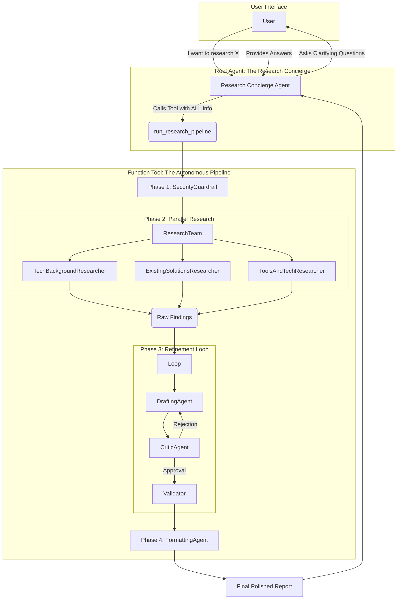

# Autonomous Research Concierge


**A Multi-Agent System that bridges the gap between vague human intent and professional-grade research through autonomous orchestration.**

> *This project is a submission for the [Kaggle Agents Intensive Capstone](https://www.kaggle.com/competitions/agents-intensive-capstone-project).*

## 📖 Project Overview
The **Autonomous Research Concierge** is designed to solve the "garbage-in, garbage-out" problem inherent in standard LLM interactions. Instead of hallucinating answers to vague prompts, this system enforces a structured workflow: **Clarify -> Research -> Refine -> Deliver.**

It acts as a personal research assistant that interviews you to understand your specific needs (audience, depth, focus) before triggering a team of specialized autonomous agents to conduct parallel research, draft content, and rigorously critique their own work until it meets quality standards.


## 🧐 Problem Statement
Manual research is laborious. It requires opening dozens of tabs, synthesizing conflicting information, and formatting it manually—a process that can take hours. Furthermore, standard LLMs often fail at deep research because users rarely provide perfect prompts on the first try. A single "monolithic" agent trying to research, write, and edit simultaneously often suffers from context overload, leading to generic or hallucinated outputs.

## 💡 Solution Statement
The **Autonomous Research Concierge** solves this by decomposing the research process into a **Multi-Agent System**.
*   **The Interviewer:** A dedicated agent ensures requirements are clear *before* any work begins.
*   **The Specialists:** Three parallel researchers (Academic, Market, Technical) gather diverse data simultaneously, reducing hallucination by grounding answers in real-time web search.
*   **The Editor:** A refinement loop ensures the first draft is never the final draft. A Critic agent forces revisions until quality standards are met.

## 🏗️ Architecture & Component Breakdown

The core of the system is the `AutonomousPipeline`, an ecosystem of specialized agents powered by Google's Agent Development Kit. It is not a monolithic script but a modular assembly of distinct intelligences.

### 1. The Orchestrator: `ResearchConcierge`
*   **File:** `research_agent/agent.py`
*   **Role:** The front-desk interface.
*   **Behavior:** Configured with a strict system instruction to **never** answer research questions directly. Instead, it acts as a requirement gatherer, interviewing the user until it has sufficient variables (Topic, Focus, Audience) to invoke the pipeline tool.

### 2. The Bridge Tool: `run_research_pipeline`
*   **File:** `research_agent/tools.py`
*   **Functionality:** A custom function tool that bridges the conversational front-end with the autonomous back-end.
*   **Key Feature:** **Session Isolation**. This function explicitly instantiates a new `InMemorySessionService()` for every request. This ensures that the thousands of tokens generated by sub-agents (raw HTML, internal debates) never pollute the user's main chat context.

### 3. The Specialist Sub-Agents
Defined in `research_agent/internal_agents.py`, these agents execute the work:

*   **`IntentSynthesisAgent`:** A "Context Compressor" that takes the chat history and distills it into a single, high-fidelity "Master Research Directive."
*   **`SecurityGuardrailAgent`:** A deterministic `BaseAgent` class that scans the directive for malicious intent (e.g., hacking instructions) before allowing any web access.
*   **`TechBackgroundResearcher`:** Specializes in theoretical architecture, algorithms, and academic concepts.
*   **`ExistingSolutionsResearcher`:** Scans the market for competitors, SOTA papers, and benchmarks.
*   **`ToolsAndTechResearcher`:** Identifies practical frameworks, libraries, and tech stacks relevant to the topic.
*   **`DynamicCriticAgent`:** The quality gatekeeper. It compares the generated draft against the user's original intent and outputs structured critiques.

### 4. The Refinement Loop
*   **Pattern:** `LoopAgent`
*   **Logic:** The system utilizes a `while` loop logic controlled by the `ReportValidationAgent`. The drafting process continues iteratively until the Critic outputs an explicit "APPROVED" signal.


## 🔄 Detailed Workflow

1.  **Interview (Requirement Gathering):** The Concierge Agent intercepts the user request. Instead of answering, it asks clarifying questions about *Target Audience*, *Specific Focus*, and *Technical Depth*.
2.  **Context Synthesis:** Once the user answers, an internal agent synthesizes the chat history into a "Master Research Directive."
3.  **Security Check:** A deterministic guardrail scans the directive for malicious intent (e.g., "how to hack") before allowing access to external tools.
4.  **Parallel Research:** The directive is sent to three specialist agents simultaneously:
    *   *TechBackgroundResearcher:* Focuses on theory and architecture.
    *   *ExistingSolutionsResearcher:* Scans for competitors and papers.
    *   *ToolsAndTechResearcher:* Recommends practical stacks.
5.  **Drafting & Critique:** The gathered data is passed to a Drafting Agent. The result is immediately reviewed by a Critic Agent. If the Critic rejects it, the Drafter must rewrite it based on feedback.
6.  **Final Polish:** Once approved, a Formatting Agent applies Markdown styling and citations before delivering the final report to the user.

## 🛠️ Essential Tools & Concepts

### 1. Custom Tool: `run_research_pipeline`
This function is the bridge between the Chat and the Work. Crucially, it implements **Session Isolation**. It creates a fresh, temporary memory space for the sub-agents. This ensures that the thousands of tokens generated during research (raw HTML, internal debates) do not pollute the user's main chat context.

### 2. Built-in Tool: `google_search`
Used by all research sub-agents to ground their findings in real-time data, ensuring the report is current and not limited by the model's training cutoff.

### 3. Orchestration Patterns
*   **Sequential Agents:** Used for the main pipeline flow to ensure dependencies are met.
*   **Parallel Agents:** Used to run researchers simultaneously to reduce latency.
*   **Loop Agents:** Used for the Draft/Critique cycle to ensure quality control.

## 📂 Project Structure
```bash
Autonomous-Research-Concierge/
├── research_agent/
│   ├── agent.py            # Entry point. Defines the Concierge and App wrapper.
│   ├── internal_agents.py  # Definitions of all sub-agents (Researchers, Critic, Guardrails).
│   ├── tools.py            # The custom tool logic that bridges Chat and Work.
│   ├── config.py           # Model configurations and API setups.
│   └── __init__.py         # Package initialization.
├── .env                    # API Keys (Not uploaded to GitHub).
├── .gitignore              # Security rules.
├── requirements.txt        # Python dependencies.
├── LICENSE                 # Apache 2.0 License.
└── README.md               # This file.
```

## ⚙️ Detailed Setup & Installation

This project was built using **Python 3.10+**. Follow these steps to set up your local development environment.

### 1. Clone the Repository
```bash
git clone https://github.com/Waqas01CP/Autonomous-Research-Concierge.git
cd Autonomous-Research-Concierge
```

### 2. Set up the Virtual Environment
It is highly recommended to use a virtual environment to manage dependencies.

**For Windows:**
```bash
python -m venv venv
.\venv\Scripts\activate
```

**For macOS/Linux:**
```bash
python3 -m venv venv
source venv/bin/activate
```

### 3. Install Dependencies
```bash
pip install -r requirements.txt
```

### 4. Configure Credentials
You need a Google Gemini API key to run the agents.
1.  Create a file named `.env` in the root directory.
2.  Add your key:
    ```env
    GOOGLE_API_KEY=your_actual_gemini_api_key_here
    ```

### 5. Run the Application
Start the ADK web server.
```bash
adk web
```
*Note: Ensure you run this command from the root folder containing the `research_agent` directory.*

### 6. Access the Interface
Open your browser and navigate to:
[http://127.0.0.1:8000](http://127.0.0.1:8000)


## 💎 Value Statement
This agent reduces the time required for deep technical research by **90%**. Instead of spending hours searching, reading, and summarizing, a user can simply answer three clarifying questions. The **Parallel Execution** architecture ensures speed, while the **Refinement Loop** guarantees that the final output is structured, cited, and professional, making it immediately usable for academic or business reports.

## 🏆 Competition Details
This project is submitted for the **Kaggle Agents Intensive Capstone**.
*   **Track:** Concierge Agents

## 📚 Resources & Credits

*   **Google Agent Development Kit (ADK):** [Official Repository](https://github.com/google/adk-python)
*   **Model Provider:** [Google AI Studio (Gemini)](https://aistudio.google.com/)
*   **Inspiration:** The "Agent Shutton" sample provided by the Kaggle team was a reference for the multi-agent architectural style.
*   **Visualization:** Architecture diagrams created using [Mermaid.js](https://mermaid.js.org/).

## 📄 License
This project is licensed under the Apache 2.0 License.
