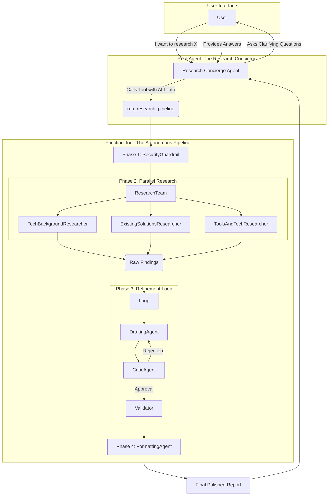

# Autonomous Research Concierge


**A Multi-Agent System that bridges the gap between vague human intent and professional-grade research through autonomous orchestration.**

> *This project is a submission for the [Kaggle Agents Intensive Capstone](https://www.kaggle.com/competitions/agents-intensive-capstone-project).*

## 📖 Project Overview
The **Autonomous Research Concierge** is designed to solve the "garbage-in, garbage-out" problem inherent in standard LLM interactions. Instead of hallucinating answers to vague prompts, this system enforces a structured workflow: **Clarify -> Research -> Refine -> Deliver.**

It acts as a personal research assistant that interviews you to understand your specific needs (audience, depth, focus) before triggering a team of specialized autonomous agents to conduct parallel research, draft content, and rigorously critique their own work until it meets quality standards.


## 🧐 Problem Statement
Manual research is laborious. It requires opening dozens of tabs, synthesizing conflicting information, and formatting it manually—a process that can take hours. Furthermore, standard LLMs often fail at deep research because users rarely provide perfect prompts on the first try. A single "monolithic" agent trying to research, write, and edit simultaneously often suffers from context overload, leading to generic or hallucinated outputs.

## 💡 Solution Statement
The **Autonomous Research Concierge** solves this by decomposing the research process into a **Multi-Agent System**.
*   **The Interviewer:** A dedicated agent ensures requirements are clear *before* any work begins.
*   **The Specialists:** Three parallel researchers (Academic, Market, Technical) gather diverse data simultaneously, reducing hallucination by grounding answers in real-time web search.
*   **The Editor:** A refinement loop ensures the first draft is never the final draft. A Critic agent forces revisions until quality standards are met.

## 🏗️ Architecture
The system utilizes a **Hybrid Orchestration Pattern**. It combines a conversational front-end (The Interview) with a deterministic back-end pipeline (The Tool).



## 🔄 Detailed Workflow

1.  **Interview (Requirement Gathering):** The Concierge Agent intercepts the user request. Instead of answering, it asks clarifying questions about *Target Audience*, *Specific Focus*, and *Technical Depth*.
2.  **Context Synthesis:** Once the user answers, an internal agent synthesizes the chat history into a "Master Research Directive."
3.  **Security Check:** A deterministic guardrail scans the directive for malicious intent (e.g., "how to hack") before allowing access to external tools.
4.  **Parallel Research:** The directive is sent to three specialist agents simultaneously:
    *   *TechBackgroundResearcher:* Focuses on theory and architecture.
    *   *ExistingSolutionsResearcher:* Scans for competitors and papers.
    *   *ToolsAndTechResearcher:* Recommends practical stacks.
5.  **Drafting & Critique:** The gathered data is passed to a Drafting Agent. The result is immediately reviewed by a Critic Agent. If the Critic rejects it, the Drafter must rewrite it based on feedback.
6.  **Final Polish:** Once approved, a Formatting Agent applies Markdown styling and citations before delivering the final report to the user.

## 🛠️ Essential Tools & Concepts

### 1. Custom Tool: `run_research_pipeline`
This function is the bridge between the Chat and the Work. Crucially, it implements **Session Isolation**. It creates a fresh, temporary memory space for the sub-agents. This ensures that the thousands of tokens generated during research (raw HTML, internal debates) do not pollute the user's main chat context.

### 2. Built-in Tool: `google_search`
Used by all research sub-agents to ground their findings in real-time data, ensuring the report is current and not limited by the model's training cutoff.

### 3. Orchestration Patterns
*   **Sequential Agents:** Used for the main pipeline flow to ensure dependencies are met.
*   **Parallel Agents:** Used to run researchers simultaneously to reduce latency.
*   **Loop Agents:** Used for the Draft/Critique cycle to ensure quality control.

## 📂 Project Structure
```bash
Autonomous-Research-Concierge/
├── research_agent/
│   ├── agent.py            # Entry point. Defines the Concierge and App wrapper.
│   ├── internal_agents.py  # Definitions of all sub-agents (Researchers, Critic, Guardrails).
│   ├── tools.py            # The custom tool logic that bridges Chat and Work.
│   ├── config.py           # Model configurations and API setups.
│   └── __init__.py         # Package initialization.
├── .env                    # API Keys (Not uploaded to GitHub).
├── .gitignore              # Security rules.
├── requirements.txt        # Python dependencies.
├── LICENSE                 # Apache 2.0 License.
└── README.md               # This file.
```

## ⚙️ Setup & Installation

**1. Clone the repository**
```bash
git clone https://github.com/Waqas01CP/Autonomous-Research-Concierge.git
cd Autonomous-Research-Concierge
```

**2. Install Dependencies**
```bash
pip install -r requirements.txt
```

**3. Configure Environment**
Create a `.env` file in the root directory:
```env
GOOGLE_API_KEY=your_actual_gemini_api_key_here
```

**4. Run the Agent**
```bash
adk web
```

**5. Access the UI**
Open your browser to `http://127.0.0.1:8000`.

## 💎 Value Statement
This agent reduces the time required for deep technical research by **90%**. Instead of spending hours searching, reading, and summarizing, a user can simply answer three clarifying questions. The **Parallel Execution** architecture ensures speed, while the **Refinement Loop** guarantees that the final output is structured, cited, and professional, making it immediately usable for academic or business reports.

## 🏆 Competition Details
This project is submitted for the **Kaggle Agents Intensive Capstone**.
*   **Track:** Concierge Agents

## 📄 License
This project is licensed under the Apache 2.0 License.
